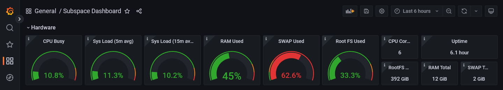
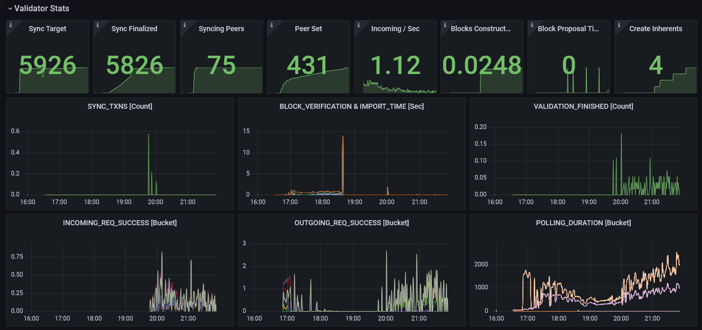
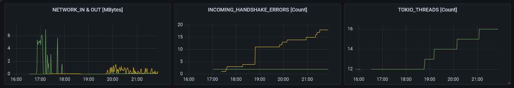
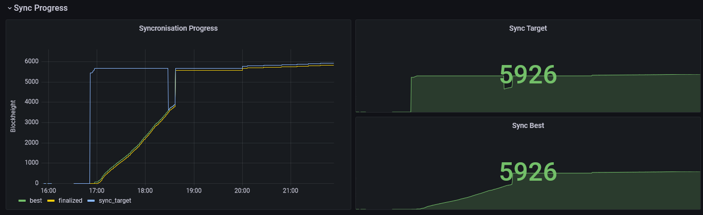
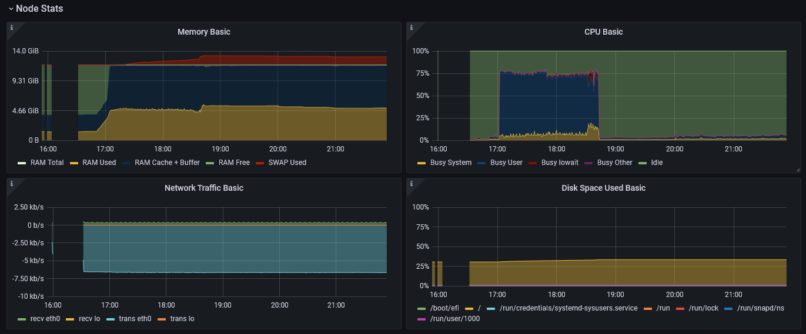
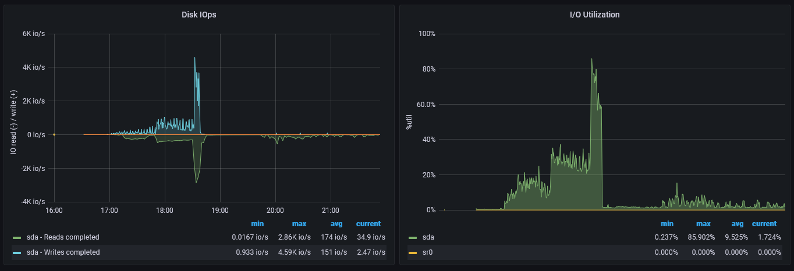

# Subspace Monitoring

Subspace node and farmer with monitoring stack using Docker Compose.

## Important Note

This is a basic setup that is only recommended for use on a computer/server which is on a secure network with fully understood ingress. This is becuase we will be opening ports to the whole network that should always be controlled with additional access rules when that means the internet.

## Overview

This repository extends the Subspace Docker compose setup to include a monitoring solution that allows the user to track instantaneous performance as well as look for trends in the way their node is operating over time. It is made up of the following components:

  - Subspace Node
  - Subspace Farmer
  - Grafana
  - Prometheus
  - Node Exporter

In this version, all of these items are setup to run under a single Docker compose though there are ways to use the same stack (or parts thereof) as bare metal by installing the relevant applications outside of Docker though there are considerations to be made on how the Docker network will talk to the host machine.

## A Detailed Look

At the core of this solution are the Subspace Node and Farmer. These are containerised versions of the application which you can read more about here: https://github.com/subspace/subspace/blob/main/docs/farming.md. We take the example `docker-compose.yml` offered here and add the following extra Docker images:

  - Grafana (https://grafana.com/)
    - Allows us to visualise the monitoring data we are collecting. It enables us to hook 'scraped' data up to dashboards that give us an easy on the eye way of interpreting the raw data.
  - Prometheus (https://prometheus.io)
    - Prometheus is an open-source systems monitoring and alerting toolkit. In our setup we are using Prometheus to organise the data we are getting from a few places and expose it in a common data source we will hook Grafana up to.
  - Node Exporter (https://grafana.com/oss/prometheus/exporters/node-exporter)
    - Exposes raw data about the hardware performance of the machine the stack is running on. CPU/IO usage for example.

A custom dashboard has been written that will automatically be provisioned when the user runs `docker compose up`.

## Getting Started

  - First, clone the repository at https://github.com/counterpointsoftware/subspace-monitoring. You can do this with the command `git clone https://github.com/counterpointsoftware/subspace-monitoring.git`. This will get you the default setup which you will now need to customise in the following ways:
    - Ensure you have the latest images referenced by checking the 'Subspace' section against the official documentation at https://github.com/subspace/subspace/blob/main/docs/farming.md#-docker-instructions. We aim to keep the repository up-to-date but, until this is automated, there will be a short delay between the team updating their documentation and us reacting to that change.
    - Enable the Prometheus stats on the Subspace node. This is done by adding the following lines to the `command` section of the `node` service (remember you will need to add trailing commas as appropriate):
      - `"--prometheus-external"`
      - `"--prometheus-port", "9615"`
      - In addition, we will need to expose port 9615 to the Docker network with:
        - `    expose:`
        - `      - "9615:9615"`
    - Follow the official instructions to ensure you customise Subspace parameters as necessary:
      - Replace snapshot-DATE with the latest release (not pre-release!) snapshot (like snapshot-2022-apr-29)
      - Replace INSERT_YOUR_ID with desired name that will be shown in telemetry (doesn't impact anything else)
      - Replace WALLET_ADDRESS with your wallet address
      - Replace PLOT_SIZE with plot size in gigabytes or terabytes, for instance 100G or 2T (but leave at least 10G of disk space for node)
      - If you want to store files on a separate disk or customize port, read comments in the file
    - Set Grafana admin username and use a strong password by editing these lines:
      - `GF_SECURITY_ADMIN_USER=ADMIN`
      - `GF_SECURITY_ADMIN_PASSWORD=StrongPassword`

Once all of these steps have been followed you should be able to open a terminal and navigate to the same folder the `docker-compose.yml` file you've been editing is located before running the `docker compose up --detach` command. Once the stack has initialised you should be able to access Grafana on http://localhost:3000.

## The Subspace Dashboard

The main dashboard is split up into four sections:

### Hardware

An at-a-glance state of the how the host hardware is performing.

### Validator Stats

Metrics being exposed by the Prometheus interface on the Subspace Node. Credit goes to Alan Yoon#2149 on Discord for this section.

### Sync Progress

How are we doing with reaching the chainhead?

### Node Stats

A closer look at some of the more relevant hardware metrics.

## Troubleshooting

  - To see what is going on with your containers you can issue the command `docker compose logs --tail=1000 --follow`. Make sure you are in the same folder as your `docker-compose.yml`.

## A Note On Security

At the top of this readme there is a note that this simple configuration should only be used when the stack is being run on a machine which is already part of a secure network. This typically means a laptop or desktop PC which is in your home behind the same firewall that protects all of your home devices.

The reason for this is that Docker uses IP tables to setup its networks and will override certain software firewalls which may be running on your machine and results in ports being exposed to everyone on the internet. The main situation this would occur is where the Docker host is a server in a datacentre.

Additional security should be applied to harden the server so that only particular addresses (yours) should be able to access the Grafana port. A better alternative may be to setup a reverse proxy which gives a granular control over access rules.

## Bare Metal Gang

If you prefer to use bare metal rather than Docker solutions and would like to use this monitoring stack I would suggest you take a look at this repository put together by jrwashburn#0765 https://github.com/jrwashburn/subspace-utils. We have collaborated so that you will end up with essentially the same solution but without the need for Docker. It also uses Docker cloud and a Prometheus push so is more suited to a datacentre environment.

## Coming Soon (TODOs)

  - Parameterised convenience script.
  - Alerting.
  - Explanation of host networking to mix bare metal and Docker components.
  - Multi node support.
  - Dashboard upload.
  - Public playground.
